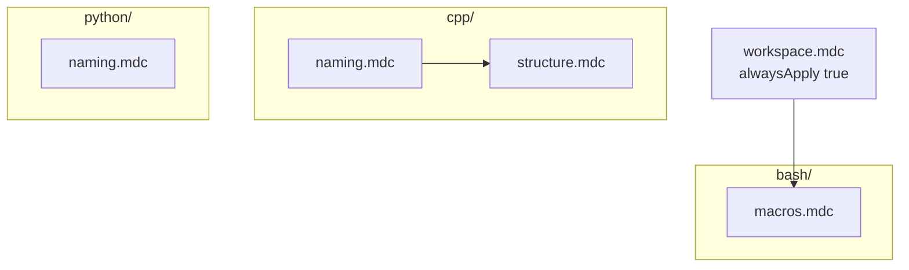

# Plan: rules — opcja D (foldery per język)

## Struktura katalogów (wybrana: opcja D)

```
.cursor/rules/
├── workspace.mdc              # zawsze aktywna
├── bash/
│   └── macros.mdc             # makra + prefiksy bash
├── cpp/
│   ├── naming.mdc             # jak nazywać (prefiksy, enum, terminologia)
│   └── structure.mdc          # jak układać kod (hpp/cpp, metody, stany)
└── python/
    └── naming.mdc             # prefiksy PEP 8
```

Usunąć po migracji: [`.cursor/rules/naming-prefixes.mdc`](.cursor/rules/naming-prefixes.mdc).



---

## Kontrola `alwaysApply` vs `globs`

| Plik | `alwaysApply` | `globs` | Dlaczego |
|------|---------------|---------|----------|
| `workspace.mdc` | `true` | — | setup, build, layout — potrzebne zawsze |
| `bash/macros.mdc` | `false` | `scripts/**/*.bash` | tylko przy edycji makr |
| `cpp/naming.mdc` | `false` | `**/*.{hpp,cpp,h}` | tylko przy C/C++ |
| `cpp/structure.mdc` | `false` | `**/*.{hpp,cpp,h}` | tylko przy C/C++ |
| `python/naming.mdc` | `false` | `**/*.py` | tylko przy Pythonie |

**Sterowanie:** edycja frontmatter w `.mdc`; Cursor Settings → Rules; rule picker w czacie. Dwa pliki w `cpp/` przy tym samym globie — Cursor łączy oba przy otwartym `.cpp`.

---

## Tabela plików — co zawiera każdy

| Ścieżka | `description` (frontmatter) | Zawartość |
|---------|----------------------------|-----------|
| [`workspace.mdc`](.cursor/rules/workspace.mdc) | Workspace: setup, build/cbuild, paczki ROS 2 | Istniejące punkty + **sekcja Build** (poniżej) |
| [`bash/macros.mdc`](.cursor/rules/bash/macros.mdc) | Bash: makra workspace, prefiksy, namespace API | `is_`/`get_`/`set_`; **bez duplikacji** `diag::_diag_foo` → `_foo` + `diag::_foo`; publiczne `build`/`diag` bez prefiksu |
| [`cpp/naming.mdc`](.cursor/rules/cpp/naming.mdc) | C++: prefiksy Is/Get/Set, pola vs metody, enum | Tabela prefiksów; pola bez `is_`; legacy `is_48v_active_`; „Nazwa = rzeczywista rola”; `FooToString` — skrót → `cpp/structure` |
| [`cpp/structure.mdc`](.cursor/rules/cpp/structure.mdc) | C++: header/cpp, stałe, metody, stany enum | hpp vs cpp; `k_snake_case`; ekstrakcja `read`/`write`; zmienne jednorazowe; **`enum class` stanów** (`PowerStage`, `ActivationState`); TODO/logi; wątki (przypomnienie) |
| [`python/naming.mdc`](.cursor/rules/python/naming.mdc) | Python: prefiksy PEP 8 | `is_`/`has_`/`get_`/`set_`; akcje bez prefiksu; odsyłacz do semantyki w `cpp/naming` |

W każdym pliku `bash/`, `cpp/`, `python/` pierwsza linia treści:
`Build/setup → ../workspace.mdc. C++: naming + structure w cpp/.`

---

## Część 1: [`workspace.mdc`](.cursor/rules/workspace.mdc)

Dodać sekcję (zachować resztę):

```markdown
## Build (`build` / `cbuild`)

- `build` / `cbuild` → colcon na `./src` — tylko **paczki ROS 2** (`package.xml`, wykryte przez colcon).
- Lista paczek: `colcon list` (w katalogu z `./src`) lub `diag`.
- `--packages-select` — tylko nazwy z `colcon list`.

### Subprojekty CMake (nie colcon)

`drivers/can_driver_core/`, `motor_raw_can_driver/` itd. pod `husarz_hardware_interface` to **CMake** (`fetch_driver`), nie paczki colcon.

- ✅ `cbuild --packages-select husarz_hardware_interface`
- ❌ `cbuild --packages-select can_driver_core`
```

---

## Część 2: [`bash/macros.mdc`](.cursor/rules/bash/macros.mdc)

```yaml
---
description: "Bash: makra workspace, prefiksy, namespace bez duplikacji"
globs: "scripts/**/*.bash"
alwaysApply: false
---
```

Namespace ([`helpers_list.bash`](scripts/bash_macros/include/helpers_list.bash)):
```bash
eval "${namespace}::${short}() { ${short} \"\$@\"; }"
```
- ❌ `_diag_search` → `diag::_diag_search`
- ✅ `_search` → `diag::_search`

---

## Część 3: [`cpp/naming.mdc`](.cursor/rules/cpp/naming.mdc)

Migracja z `naming-prefixes.mdc`: tylko sekcje C++ + ogólna semantyka prefiksów (bez tabeli bash/python — te w swoich folderach).

```yaml
---
description: "C++: prefiksy Is/Get/Set, pola vs metody, enum ToString, terminologia"
globs: "**/*.{hpp,cpp,h}"
alwaysApply: false
---
```

---

## Część 4: [`cpp/structure.mdc`](.cursor/rules/cpp/structure.mdc)

Pełna treść organizacyjna z wcześniejszego planu (header/cpp, metody, zmienne jednorazowe, enum stanów, czytelność).

```yaml
---
description: "C++: header vs cpp, stałe, metody, enum class stanów, czytelność"
globs: "**/*.{hpp,cpp,h}"
alwaysApply: false
---
```

Odsyłacz: nazewnictwo → [`cpp/naming.mdc`](.cursor/rules/cpp/naming.mdc).

---

## Część 5: [`python/naming.mdc`](.cursor/rules/python/naming.mdc)

```yaml
---
description: "Python: prefiksy is/has/get/set (PEP 8)"
globs: "**/*.py"
alwaysApply: false
---
```

~15 linii; semantyka jak w `cpp/naming` (ta sama logika prefiksów).

---

## Część 6: Migracja

1. Utworzyć foldery `bash/`, `cpp/`, `python/` w [`.cursor/rules/`](.cursor/rules/).
2. Utworzyć 4 nowe `.mdc` + zaktualizować `workspace.mdc`.
3. Usunąć [`naming-prefixes.mdc`](.cursor/rules/naming-prefixes.mdc).
4. Opcjonalnie w [`AGENTS.md`](AGENTS.md): bullet ze ścieżkami `bash/macros`, `cpp/naming`, `cpp/structure`, `python/naming`.

---

## Część 7: Smoke test

| Prośba | Oczekiwane zachowanie |
|--------|----------------------|
| „zbuduj can_driver_core” | `cbuild --packages-select husarz_hardware_interface` |
| „helper diag do szukania” | `_search_*`, nie `_diag_search_*` |
| „dodaj stan power” | `enum class` + `FooToString` w `.hpp` |
| edycja `.cpp` | aktywne `cpp/naming` + `cpp/structure` |
| edycja `scripts/*.bash` | aktywne `bash/macros` |

---

## Mapowanie review → plik

| Temat | Plik |
|-------|------|
| prefiksy, terminologia, enum nazwy | `cpp/naming.mdc` |
| header/cpp, metody, enum stanów, zmienne | `cpp/structure.mdc` |
| namespace makr | `bash/macros.mdc` |
| build ROS 2 / can_driver_core | `workspace.mdc` |
| Python prefiksy | `python/naming.mdc` |
