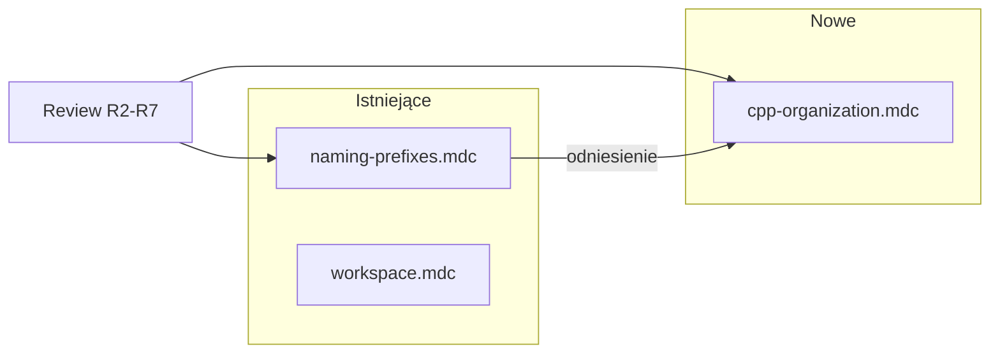

# Plan: aktualizacja rules (naming + nowa cpp-organization)

## Kontekst

Przegląd 7 serii review (Oskar, Konrad) + aktywacja driverów wskazuje **dwa osobne obszary**:

| Obszar | Obecna reguła | Pokrycie review |
|--------|---------------|-----------------|
| Semantyka prefiksów (`is`/`get`/`set`…) | [`naming-prefixes.mdc`](.cursor/rules/naming-prefixes.mdc) | ~30% feedbacku |
| Organizacja plików, metody, stałe, format | **brak** | ~60% feedbacku (R2-06/07/16, R5-01–05, R6-12/14, R-01/04) |

Reszta (~10%) to logika domenowa / threading — **poza rules** (backlog MR, nie konwencja stylu).



---

## Część 1: Poprawki [`naming-prefixes.mdc`](.cursor/rules/naming-prefixes.mdc)

**Zachować:** `alwaysApply: true`, obecną strukturę (prefiksy, C++ pola vs metody, tabele per język).

**Dodać jedną sekcję** (~12 linii) — „Nazwa opisuje rzeczywistość” (wnioski z review, bez duplikowania cpp-organization):

```markdown
## Nazwa = rzeczywista rola (nie aspiracja)

- Nazwa musi opisywać **co to jest**, nie co „chciałeś osiągnąć”.
  - ✅ `GetVelocityInterfaceName()` — nazwa interfejsu velocity
  - ❌ `WheelVelocityClaimName()` — to nie jest „claim”
- **Ta sama terminologia** w całym pliku/modułe (`drivetrain`, nie `axle` jeśli reszta kodu używa `drivetrains_`).
- **Wzorzec istniejący w pliku** wygrywa nad nowym: `PowerStageToString` → nowe enumy też `FooToString`, nie `HardwareStateName`.
- Enum: krótkie, jednoznaczne wartości (`STOPPED`, `ACTIVE`) zamiast złożonych (`SAFE_STOPPED`, `RELEASED_ACTIVE`) gdy nie dodają informacji.
- Zmienna bool o **semantyce domeny**: nazwa oddaje warunek (`motor_hw_engaged_`), nie ogólnik (`drive_permitted` gdy chodzi o hardware, nie software safety).
```

**Drobna korekta** w sekcji „C++ — pola vs metody”:
- Dodać zdanie: *„Legacy z `is_*_` na polach (np. `is_48v_active_`) — nie refaktoruj bez prośby; nowe pola bez `is_`.”* — żeby reguła nie kłóciła się z istniejącym kodem w [`husarz_hardware_interface.hpp`](src/husarz_ws/src/dodanie_trybu_sterowania_motorami_w_driver_hi_urdf/test/src/husarz_hardware_interface/include/husarz_hardware_interface/husarz_hardware_interface.hpp).

**Nie dodawać** do naming-prefixes: includes, ekstrakcja metod, TODO, logi — to idzie do cpp-organization.

**Docelowa długość:** ~80 linii (nadal czytelna; sekcja nazw to osobny temat od prefiksów).

---

## Część 2: Nowa reguła [`cpp-organization.mdc`](.cursor/rules/cpp-organization.mdc)

### Frontmatter (propozycja)

```yaml
---
description: Organizacja kodu C++ — header vs cpp, stałe, metody, czytelność (husarz / workspace)
globs: "**/*.{hpp,cpp,h}"
alwaysApply: false
---
```

`alwaysApply: false` + globs — reguła włącza się przy edycji C/C++, nie zaśmieca sesji bash-only. `naming-prefixes` zostaje globalna.

### Pełna proponowana treść reguły

```markdown
# Organizacja kodu C++

Konwencje z code review `husarz_hardware_interface` i driverów CAN. Dotyczy **nowego kodu** — nie refaktoruj legacy bez prośby. Prefiksy nazw → reguła `naming-prefixes`.

## Header (.hpp) vs source (.cpp)

| Co | Gdzie | Przykład z review |
|----|-------|-------------------|
| Deklaracje metod klasy, stałe współdzielone, małe helpery | `.hpp` (lub `*_helpers.hpp`) | R5-01: stałe z `.cpp` → header |
| `#include` wymagany przez deklaracje w headerze | `.hpp`, nie tylko `.cpp` | R2-06: `<thread>` przy metodach używających `std::thread` |
| Structy-dane używane przez klasę | poza klasą, w tym samym `.hpp` | R2-02: `RxFrames` / `TxFrames` obok `MotorRawCanDriver` |
| Implementacja metod | `.cpp` | — |
| Stałe **tylko dla tego translation unit** | `static constexpr` w `.cpp` | R2-07: `k_rm_device_id_mask` w `.cpp` zamiast `#define` |

**Unikaj:** anonimowego namespace w `.cpp` z helperami/stałymi, które mogą być potrzebne w innym pliku lub testach — to „chowanie” API (R5-01, R3-17).

## Stałe

- Format: `k_snake_case` (np. `k_mode_confirmation_timeout_ms`, `k_estop_settle_time`).
- Współdzielone między plikami → `inline constexpr` lub `static constexpr` w `.hpp`.
- Prywatne dla jednego `.cpp` → `static constexpr` na górze pliku (jak `k_rad_s_to_rpm` w [`husarz_hardware_interface_io.cpp`](src/husarz_ws/.../husarz_hardware_interface_io.cpp)).
- Preferuj `static constexpr` nad `#define` (R2-07).

## Metody zamiast monolitów

Wyciągaj **prywatne metody** gdy:
- `read()` / `write()` / `on_activate()` / długi lifecycle ma >1 odpowiedzialność (motory, steering, GPIO, BMS…).
- Ten sam warunek (`drive_permitted`, power stage) powtarza się wielokrotnie — **jeden gate wysoko** (R6-14).

Wzorzec z review (R6-12, R7-05 — już wdrożony częściowo):
```cpp
// write() — szkielet
void write(...) {
    const PowerStage current_power_stage = ...;  // snapshot na początku
    StoreEnable48vCommand();
    if (!IsHighVoltageLive(current_power_stage)) { ...; return; }
    if (drive_permitted) {
        WriteMotorVelocityCommands();
        WriteSteeringPositionCommands();
    } else {
        ZeroReleasedMotorVelocities();
    }
}
```

**Układ w klasie:** gettery/settery w jednym bloku, bez logiki między nimi (R2-16).

## Czytelność

- Pusta linia między logicznymi blokami i **przed** komentarzem/docstringiem (R3-11, R5-03–05).
- Komentarze techniczne: precyzyjne (np. „output power / FET off”, nie ogólne „power off” — R2-12).
- **TODO:** jedna linia + numer issue; bez akapitów w kodzie (R-03, R-04). Przykład: `// TODO(#123): re-handshake after failed Activate`.
- **Logi:** nie duplikuj — jeśli `LogCanDeviceActivationErrors()` już loguje, nie dodawaj drugiego `RCLCPP_ERROR` z tym samym (R-01).

## Współdzielony stan między wątkami (przypomnienie, nie pełny design)

- Snapshot na początku `read()`/`write()`: `const PowerStage current_power_stage = power_stage_.load()` pod mutexem (R6-01).
- Flagi współdzielone: `std::atomic` lub mutex + komentarz dlaczego.
- Przy nowym wątku (np. 48V loop): rozważ mutex/CV i udokumentuj założenia kolejności (R7-02) — szczegóły w MR/issue, nie w tej regule.

## Wykluczenia

- Nie zmieniaj API ROS / override’ów bez potrzeby.
- Decyzje produktowe (partial activate, `hw_state_`, parametry URDF hardcoded vs config) — issue/MR, nie reguła stylu.
- Reużyj istniejące API modułu zanim napiszesz własną pętlę (np. `IsErrorCodeActive` z can_core — R2-11) — jedna linia przypomnienia.
```

**Docelowa długość:** ~55–65 linii.

---

## Część 3: Relacja między regułami

| Plik | Kiedy aktywna | Odpowiedzialność |
|------|---------------|------------------|
| [`workspace.mdc`](.cursor/rules/workspace.mdc) | zawsze | setup, macros, build |
| [`naming-prefixes.mdc`](.cursor/rules/naming-prefixes.mdc) | zawsze | prefiksy, pola vs metody, terminologia nazw |
| **`cpp-organization.mdc`** (nowy) | przy `*.hpp` / `*.cpp` / `*.h` | pliki, stałe, metody, format, TODO/logi |

W `cpp-organization` pierwsza linia odsyła do `naming-prefixes` — bez duplikacji tabel prefiksów.

---

## Część 4: Czego świadomie NIE robimy

- **Osobna reguła threading** — za wąska i zależna od architektury (R6-15, R7-07).
- **Skill** — redundantny przy rules + globs.
- **Reguła w subrepo** `husarz_hardware_interface/.cursor/` — workspace rule w root wystarczy ([`AGENTS.md`](AGENTS.md): subrepo rules są opcjonalne).
- **Migracja legacy** — `is_48v_active_`, monolityczne fragmenty `read()` — tylko przy dotykaniu pliku.

---

## Część 5: Kroki implementacji (po akceptacji)

1. Edytować [`naming-prefixes.mdc`](.cursor/rules/naming-prefixes.mdc):
   - dodać sekcję „Nazwa = rzeczywista rola”,
   - dopisać zdanie o legacy `is_*_` na polach.
2. Utworzyć [`cpp-organization.mdc`](.cursor/rules/cpp-organization.mdc) z treścią z części 2.
3. Smoke test (mentalny / jedna prośba do agenta):
   - *„Dodaj stałę timeout i helper do modes.cpp”* → agent powinien zaproponować `.hpp` + `k_snake_case`.
   - *„Rozbij write() o nowy sensor”* → agent powinien zaproponować `UpdateXxxStates()` zamiast 50 linii inline.
4. Opcjonalnie: krótka wzmianka w [`AGENTS.md`](AGENTS.md) (1 bullet) o dwóch regułach stylu — tylko jeśli chcesz widoczność dla ludzi; nie jest wymagane.

---

## Mapowanie review → reguła (pełna tabela)

| ID review | Temat | Reguła |
|-----------|-------|--------|
| R2-06, R5-01/02 | includes / stałe w hpp | cpp-organization |
| R2-07 | static constexpr vs #define | cpp-organization |
| R2-16, R6-12, R7-05 | metody, gate warunku | cpp-organization |
| R2-02 | structy poza klasą | cpp-organization |
| R3-11, R5-03–05 | whitespace | cpp-organization |
| R-01, R-03/04 | logi, TODO | cpp-organization |
| R2-12 | precyzyjne komentarze | cpp-organization |
| R3-20, R3-18/21, R6-05, R7-06 | nazwy, terminologia | naming-prefixes (nowa sekcja) |
| R2-11 | reużyj can_core | cpp-organization (1 bullet) |
| R6-15, R7-07 | mutex/CV design | wyklączenie / issue |
| R3-25–29, R7-03 | logika biznesowa | wyklączenie |
